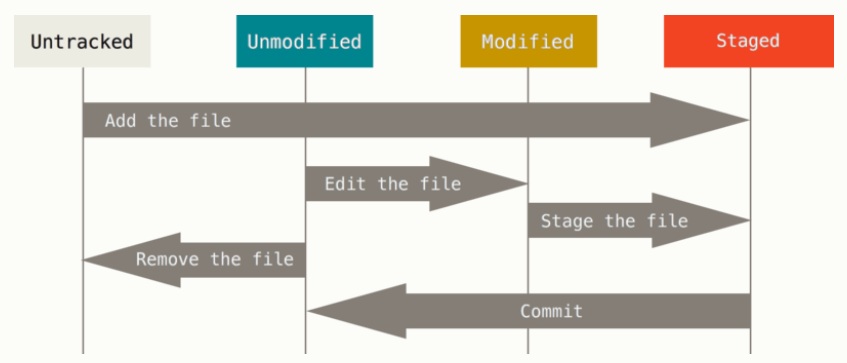
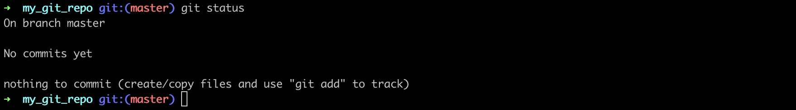
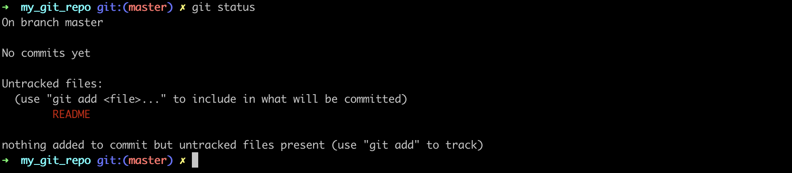
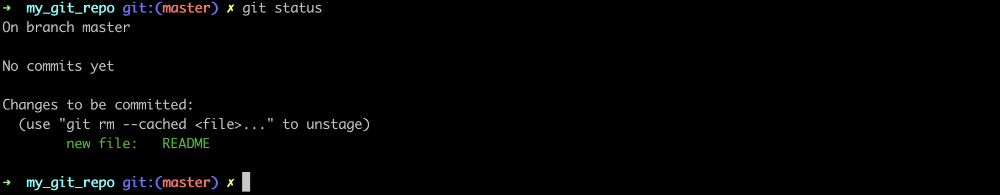
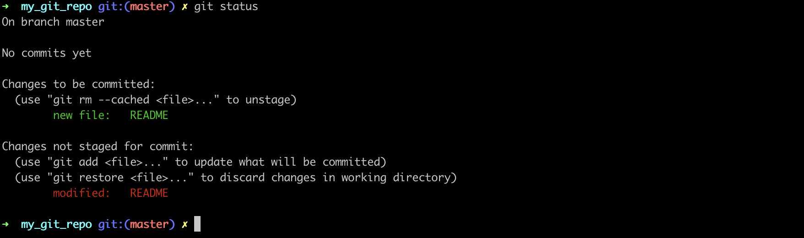

---
​---
title : 'git-01-init'
​---
---

# git

## 새로운 저장소를 `init` 하기

```shell
$ mkdir my_git_repo
$ cd my_git_repo
$ git init
```

`git init` 이란 명령은 `.git` 이라는 하위 디렉토리를 만듬


## 기존 저장소를 `clone` 하기

```shell
$ git clone ${repo_url}
```


## 파일 `status`  확인하기

워킹 디렉토리의 모든 파일은 크게 Tracked(관리대상)와 Untracked(관리대상아님)로 나눔


### Tracked & Untracked

Tracked 파일은 이미 스냅샷에 포함돼 있던 파일이며 다음 상태중 하나이다.  

- Unmodified(수정하지 않음)
- Modified(수정)
- Staged(커밋으로 저장소에 기록)

Untracked 파일은 Tracked 파일이 아닌 나머지 모든 파일이며 워킹 디렉토리에 있는 파일 중 스냅샷에도 Staging Area에도 포함되지 않음 파일




### status

```shell
$ git status
```


#### --short (-s)

```shell
$ git status -s
$ git status --short
```


- `??` - Untracked

- `A` - Staged
- `M` - Modified


위의 옵션을 미루어 보아 README는 Staged에 있지만 Modified된 파일이다.


### 파일 상태에 따른 노출값

#### Nothing




#### Untracked




#### Tracked




#### Modified -> Stage

이미 Tracked 상태인 파일을 수정하고 해당 명령어를 입력하면 다음과 같다

Changes not staged for commit 은 Tracked 상태이지만 Staged 상태는 아니라는 의미




## 변경파일을 `add` 하기

`git add` 명령으로 파일을 새로이 추적할 수 있음 (프로젝트에 파일을 추가한다기 보단 다음 커밋에 추가한다는 의미)

위에서 확인하듯 명령이 실행되면 README 파일이 Tracked 상태이면서 커밋에 추가될 Staged 상태라는 것을 확인 할 수 있음

```shell 
$ git add LICENSE
$ git add *.c
$ git add .
```


Changes to bt committed에 들어 있는 파일은 Staged 상태라는 것을 의미

커밋하면 git add 를 실행한 시점의 파일이 커밋되어 저장소 히스토리에 남음


