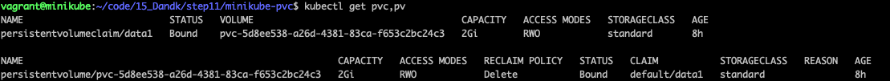

cd ~/code/tutorial/15_Dandk/vagrant-minikube

vagrant up

vagrant ssh

sudo minikube start


K8s에 배포한 애플리케이션이 데이터를 보존하기 위해 내부 혹은 외부의 스토리지 시스템과 연결하여 `퍼시스턴트 볼륨`을 이용

- 내부 스토리지
- 외부 스토리지 (권장)
  - 전용 스토리지
  - 소프트웨어로 일반적인 서버를 클러스터화하여 저장장치로 사용하는 SDS(Software Defined Storage)


배워볼것

- 스토리지추상화의 필요성과 구조
- 다이내믹 프로비저닝
- 매뉴얼 설정
- 클라우드 환경에서 퍼시스턴트 볼륨 사용
- 온프레미스 환경에서 SDS 연동


## 스토리지 종류

### 노드내부에서 사용하는 볼륨

- emptyDir (일시적으로 사용하는 방법, 파드가 종료되면 삭제된다.)
- hostPath (노드의 디스크를 사용하고 파드와 함께 지워지지 않으나, 같은 노드에 배포된 서로 다른 파드에서 볼륨을 공유할 수 없음)


### 외부스토리지를 연결하는 방법 

각 방식마다 동작 방식이 다름 - 스토리지 시스템의 특징에 따라 퍼시스턴트 볼륨의 기능에 차이가 있음

- 서버와 스토리지를 연결하는 프로토콜 ( NFS, iSCSI )
- 소프트웨어
- 클라우드 스토리지 서비스


## 스토리지 추상화와 자동화

파드상의 컨테이너는 공통된 정의 방법에 따라 퍼시스턴트 볼륨을 마운트할 수 있음

- 동적 프로비저닝
- 수동으로 스토리지를 설정하는 경우


용어정리

- PVC(Persistent Volume Claim) 퍼시스턴트 볼륨 요구
- PV(Persistent Volume) 퍼시스턴트 볼륨

미리 PVC를 작성하고 파드의 매니페스트에 PVC이름을 기술하면 컨테이너가 퍼시스턴트 볼륨을 마운트함


스토리지 클래스의 목록 

```shell
$ kubectl get storageclass
```


샘플

```shell
$ git clone https://github.com/Jpub/15_Dank
$ cd codes_for_lessons/step11
```


pcv.yml

```yaml
# pcv.yml
apiVersion: v1
kind: PersistentVolumnClaim
metadata: # 이름, 레이블, 주석 등등 
	name: data1 
spec: # 스토리지의 요구사양
	accessModes:
  - ReadWriteOnce
  storageClassName: standard # 지정하지않는경우 디폴트가 선택
  resources:
  	requests:
  		storage: 2Gi
```


- metadata
  - annotations - 스토리지시스템에 넘겨주는 파라미터나 스토리지 클래스를 기술
  - labels - IKS에서는 월 단위나 시간 단위의 과금을 클라우드의 스토리지 시스템에 부여하기 위해 사용
  - name - name(이름)은 오브젝트를 특정하기 위한 필수항목으로 네임스페이스내에서 유일한 이름
- spec
  - accessModes - ReadWriteOnce, ReadOnlyMany, ReadWriteMany
  - storageClassName - 생략하면 디폴트 스토리지 클래스가 선언, 선택 가능한 스토리지 클래스 목록을 kutectl get storageclass로 확인
  - resources
    - requests - 퍼시스턴트 볼륨의 용량 (스토리지 클래스의 사양에 따라 설정가능한 용량이 정해져 있어 확인 필요)


퍼시스턴트 볼륨 요구 적용 및 퍼시스턴트 볼륨 확인

스토리지 클래스의 정보 출력

```shell
$ cd ~/code/15_Dandk/step11/minikube-pvc
$ kubectl apply -f pvc.yml

$ kubectl get pvc,pv

$ kubectl get storageclass
```




pvc와 pv가 각각 생성된 것을 확인할 수 있음


`hostpath`가 포함된 것으로 보아 가상 서버의 디스크에서 퍼시스턴트 볼륨을 만든 것

마지막 storage 설정(2Gi)을 어떤 값으로 해도 미니쿠베가 동작하는 가상서버의 스토리지 용량이 표시

 

pom.yml

```yaml
# pom.yml
apiVersion: v1
kind: Pod
metadata:
	name: pod1
spec:
	volumes:
  - name: pvc1
  	persistentVolumeClaim:
  		claimName: data1 # PVC의 이름설정
  containers:
  - nmae: ubuntu
  	image: ubuntu:16.04
  	volumeMounts: # 컨테이너의 파일시스템에 PV를 마운트
  	- name: pvc1
  		mountPath: /mnt # 컨테이너상의 마운트경로
    command: ["/bin/bin/tail", "-f", "/dev/null"]
```


- spec

  - volumes
    - name - 볼륨명
    - persistentVolumeClaim - PVC 명

  - containers
    - volumeMounts
      - name - 파드 스팩에 기재한 볼륨 이름을 기술
      - mountPath - PV 컨테이너내 마운트 경로
      - subPath - PV 특정 디렉터리에 마운트하고 싶은 경우에 해당 옵션을 지정, 생략시 PV 루트에 마운트 설정
      - readOnly - 읽기전용


파드에서 퍼시스턴트 볼륨을 마운트

```shell
$ kubectl apply -f pvc.yml # PVC 생성
$ kubectl apply -f pod.yml # 파드 생성
$ kubectl get pvc,pv,po # PVC, PV, 파드목록 표시
$ kubectl exec -it pod1 --sh # 파드에 대화형셀을 실행해서 마운트상태를 확인할 결과 (/mnt 용량에 주목)
```


### NFS 서버사용

NFS 서버에서 파드에 공개할 영역을 설정하고 PV를 작성


nfs-pv.yml(NFS 서버에 접속하기 위한 PV 생성 YAML)

```yaml
# nfs-pv.yml
apiVersion: v1
kind: PersistentVolume
metadata:
	name: nfs-1
	labels:
		name: pv-nfs-1
spec:
	capacity:
 		storage: 100Mi
  accessModes:
  - ReadWriteMany
  nfs:
  	server: 172.16.20.10 # Vagrant상의 NFS 서버의 IP 주소
    path: /export # NFS 서버가 공개하는 경로
```


- spec
  - capacity
  - accessModes
  - nfs
    - path - NFS 서버가 export 하는 경로
    - server - NFS 서버의 DNS명 또는 IP 주소


nfs-pvc.yml

```yaml
# nfs-pvc.yml
apiVersion: v1
kind: PersistentVolumeClaim
metadata:
	name: nfs-1
	labels:
		name: pv-nfs-1
spec:
  accessModes:
  - ReadWriteMany
  storageClassName: ''
  resources:
    requests:
      storage: "100Mi"
  selector: # 대응하는 PV 라벨설정
    matchLabels: 
    	name: pv-nfs-1
```


미니쿠베와 NFS 서버의 통신 확인

```shell
$ kubectl run -it bb --image=busybox sh

# 미니쿠베와 NFS 서버의 통신
/ # ping 172.16.20.10 
```


PV & PVC 작성

```shell
$ kubectl apply -f nfs-pv.yml

$ kubectl apply -f nfs-pvc.yml

$ kubectl get pv,pvc
```


mfs-client.yml (PVC 볼륨을 마운트하는 디플로이먼트)

```yaml
# mfs-client.yml
apiVersion: apps/v1
kind: Deployment
metadata: 
	name: nfs-client
spec:
	replicas: 2 # 볼륨 공유를 확인하기 위해 2개의 파드를 기동
	selector:
		matchLabels:
			app: ubuntu
  template:
  	metadata:
  		labels:
  			app: ubuntu
  	spec: 
  		containers:
  		- name: ubuntu
  			image: ubuntu:16.04
  			volumeMounts: # 컨테이너에 마운트하는 디렉터리 지정
  			- name: nfs
  				mountPath: /mnt
  			command: ["/usr/bin/tail", "-f", "/dev/null"] # 컨테이너 종료방지를 위한 명령어
  		volumes:
  		- name: nfs
  			persistentVolumeClaim:
  				claimName: nfs-1 # PVC명 설정
```


NFS 클라이언트 파드 기동

```shell
$ kubectl apply -f nfs-client.yml

$ kubectl get po
```


NFS를 사용하여 파드간 파일 공유 테스트(쓰기)

```shell
$ kubectl exec -it nfs-client-75cfc578b7-p46wg bash

...
root$ df -h
root$ ls -lR > /mnt/test.dat # NFS 상에 파일을 만들고
root$ md5sum /mnt/test.dat # 해시 계산 > 다른 파드에서 실행한 해시값과 일치하면 파일이 제대로 공유됐다고 볼 수 있음
root$ exit
```


쓰기


읽기


### 클라우드 동적 프로비저닝

퍼블릭 클라우드에서 퍼시스턴트 볼륨 요구(PVC)를 만들고, 컨테이너에서 마운트하는 과정

- IKS(IBM)

- GKE(google)


다음의 블록 스토리지는 iSCSI를 사용

SCSI는 한 대의 컴퓨터에 여러개의 하드디스크 드라이브를 연결하기 위한 기술이고 SCSI 케이블로 호스트 어댑터에 하드디스크 드라이브를 연결, NFS와 비교해서 고속으로 동작하는 특징이 있으나 복수의 호스트 어댑터에서 하드디스크 드라이브를 공유할 수 없음


iks-pvc-block.yml

```yaml
# iks-pvc-block.yml
apiVersion: v1
kind: PersistentVolumeClaim
metadata:
  name: bronze-blk
  annotations:
    volume.beta.kubernetes.io/storage-class: "ibmc-block-bronze"
  labels:
    billingType: "hourly"
spec:
  accessModes:
    - ReadWriteOnce   ## Block(iSCSI)이므로 다중 접속 불가
  resources:
    requests:
      storage: 20Gi   ## 프로비저닝 요구 용량(GB)
```


gke-pvc-block.yml

```yaml
# gke-pvc-block.yml
apiVersion: v1
kind: PersistentVolumeClaim
metadata:
  name: bronze-blk
spec:
  accessModes:
    - ReadWriteOnce   ## Block(iSCSI)를 위한 다중 접속 불가
  resources:
    requests:
      storage: 20Gi   ## 프로비저닝 요구 용량(GB)
```


## GlusterFS - SDS 연동에 의한 동적 프로비저닝

쿠버네티스와 SDS(Software Defined Storage)를 연동하면 온

프레미스(자사데이터센터)내에 PV의 다이나믹 프로비저닝을 실현가능


```shell
$ vagrant ssh master
$ ping 172.20.1.20
```


 gfs-sc.yml

```yaml
# gfs-sc.yml
apiVersion: storage.k8s.io/v1
kind: StorageClass
metadata:
  name: "gluster-heketi"
provisioner: kubernetes.io/glusterfs
parameters: # 프로비저너의 파라미터
  resturl: "http://172.20.1.20:8080" # Heketi의 IP 주소와 포트
  restuser: "admin" # REST 유저 ID&PW
  restuserkey: "admin"
```


```shell
$ kubectl apply -f gfs-sc.yml

$ kubectl get sc
```


gfs-pvc.yml

```yaml
# gfs-pvc.yml
apiVersion: v1
kind: PersistentVolumeClaim
metadata:
 name: gvol-1
spec:
 storageClassName: gluster-heketi
 accessModes:
  - ReadWriteMany
 resources:
   requests:
     storage: 10Gi
```


```shell
$ kubectl apply -f gfs-pvc.yml

$ kubectl get pvc

$ kubectl get pv
```


gfs-client.yml

```yaml
# gfs-client.yml
apiVersion: apps/v1
kind: Deployment
metadata:
  name: gfs-client
spec:
  replicas: 2
  selector:
    matchLabels:
      app: ubuntu
  template:
    metadata:
      labels:
        app: ubuntu
    spec:
      containers:
      - name: ubuntu
        image: ubuntu
        volumeMounts:
        - name: gfs
          mountPath: /mnt
        command: ["/usr/bin/tail","-f","/dev/null"]
      volumes:
      - name: gfs
        persistentVolumeClaim:
          claimName: gvol-1
```


```shell
$ kubectl apply -f gfs-client.yml

$ kubectl get po
```


파일쓰기 (해시값확인)

```shell 
$ kubectl exec -it gfs-client-6947c4c7fd-g7xtb sh

# ls -lR > /mnt/test.dat
# md5sum /mnt/test.dat
```


172.20.~ 로 시작하는 줄에 주목하면 

지금까지 hostPath나 수동으로 설정한 NFS와 달리 PVC의 매니페스트에서 요구한 볼륨의 크기가 표시되는 것을 확인할 수 있습니다.


파일읽기 (해시값확인)


