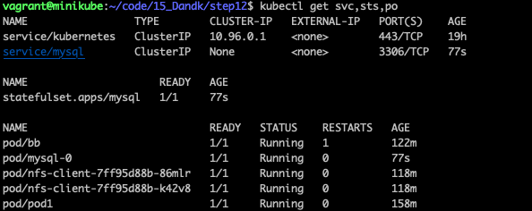
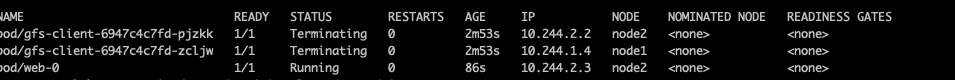
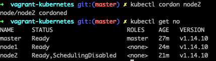
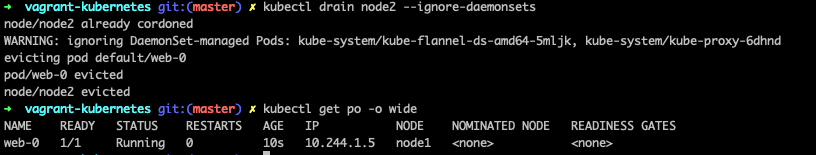
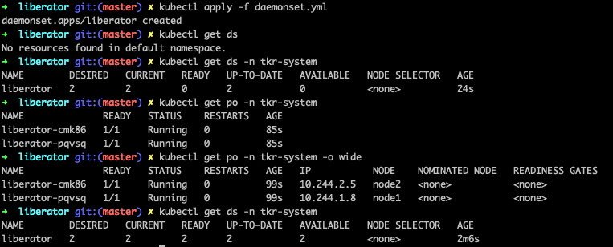

## 스테이트풀셋

퍼시스턴트 볼륨과 파드를 함께 조합하여 제어하기 적합한 `컨트롤러`

Stateful이란 내부 상태를 가져서 상태에 따라 처리 내용이 달라지는 것을 의미


> 컨테이너나 파드는 데이터를 보관하기 어렵기 때문에 파드와 퍼시스턴트 볼륨을 조합하여 실행해야 한다.
>
> 이러한 요구사항을 위해 k8s는 스테이트풀셋이라는 컨트롤러를 제공 


- 파드의 이름과 퍼시스턴스 볼륨의 이름
- 서비스와의 연결 및 이름 연결
- 파드 분실 시 동작
- 노드 정지 시의 동작 
- 파드 순번 제어


mysql-sts.yml

```yaml
# mysql-sts.yml
apiVersion: v1
kind: Service
metadata:
  name: mysql        ## 이 이름이 k8s내 DNS에 등록됨.
  labels:
    app: mysql-sts
spec:
  ports:
  - port: 3306
    name: mysql
  clusterIP: None    ## 특징① 헤드리스 서비스 설정
  selector:
    app: mysql-sts   ## 후술하는 스테이트풀셋과 연결시키는 라벨
---
## MySQL 스테이트풀셋
#
apiVersion: apps/v1         ## 표1 스테이트풀셋 참고
kind: StatefulSet
metadata:
  name: mysql
spec:                       ## 표2 스테이트풀셋 사양
  serviceName: mysql        ## 특징② 연결할 서비스의 이름 설정
  replicas: 1               ## 파드 기동 개수
  selector:
    matchLabels:
      app: mysql-sts
  template:                 ## 표3 파드의 템플릿
    metadata:
      labels:
        app: mysql-sts
    spec:
      containers:
      - name: mysql
        image: mysql:5.7    ## Docker Hub MySQL 리포지터리 지정
        env:
        - name: MYSQL_ROOT_PASSWORD
          value: qwerty
        ports:
        - containerPort: 3306
          name: mysql
        volumeMounts:       ## 특징③ 컨테이너상의 마운트 경로 설정
        - name: pvc
          mountPath: /var/lib/mysql
          subPath: data     ## 초기화 시 빈 디렉터리가 필요
        livenessProbe:      ## MySQL 기동 확인
          exec:
            command: ["mysqladmin","-p$MYSQL_ROOT_PASSWORD","ping"]
          initialDelaySeconds: 60
          timeoutSeconds: 10
  volumeClaimTemplates:     ## 특징④볼륨 요구 템플릿
  - metadata:
      name: pvc
    spec:                   ## 표4 퍼시스턴트볼륨 요구 스펙
      accessModes: [ "ReadWriteOnce" ]
      ## 환경에 맞게 선택하여, sotrage의 값을 편집
      #storageClassName: ibmc-file-bronze   # 용량 20Gi IKS
      #storageClassName: gluster-heketi     # 용량 12Gi GlusterFS
      storageClassName: standard            # 용량 2Gi  Minikube/GKE
      resources:
        requests:
          storage: 2Gi
```


스테이트풀셋 실행

```shell
$ kubectl apply -f mysql-sts.yml

$ kubectl get svc,sts,po
```



pod이름 - pod/mysql-0

pv이름 - default/pvc-mysql-0


data 작성

```shell
$ kubectl exec -it mysql-0 -- bash

# mysql -u root -pqwerty
mysql> create database hello;
mysql> show databases;
```


스테이트풀셋 제거

스테이프풀셋과 파드는 지워지지만 PVC, PV는 남아있다.

```shell
$ kubectl delete -f mysql-sts.yml

$ kubectl get svc,sts,po

$ kubectl get pvc,pv
```


스테이트풀셋 재실행

```shell
$ kubectl apply -f mysql-sts.yml

$ kubectl exec -it mysql-0 -- bash

# mysql -u root -pqwerty
mysql> show databases;
```


## 수동 테이크 오버 방법

하드웨어 보수작업으로 노드를 일시적으로 정지해야하는 경우

```shell
$ kubectl get po mysql-0 -o wide

$ kubectl cordon node2 # node2 새로운 파드의 스케줄 금지

$ kubectl drain node2 --ignore-daemonsets # 가동중인 파드를 node2에서 node1으로 이동

$ kubectl get po mysql-0 -o wide # 다시확인
```

node2에서 동작중








설정 해제

```shell
$ kubectl uncordon node2
```


주의할 점은 파드의 이동은 라이브 마이그레이션이 아니기에 MySQL 서비스를 일단 정지하고 이동함

그럼 실행중인 트랜잭션은 취소되어 롤백됩니다.

그렇기에 이러한 노드 교체 작업은 계획적으로 실시되는 것을 권장합니다.


## 노드장애시 동작

```shell
$ vagrant halt node1 # node1 중지

$ while true; do date; kubectl get no; echo; kubectl get po -o wide; echo; sleep 60; done

$ kubectl delete node node1 # node1을 삭제하여 서비스 재게

$ kubectl get po -o wide
```

스테이트풀셋의 두 가지 특징

- 퍼시스턴트 볼륨의 보호를 우선하기 때문에 장애 노드 위에서 돌던 파드를 함부로 다른 노드에 옮기지 않아요
- 스테이트 풀셋은 파드의 컨트롤러라는 역할을 넘어 노드를 삭제하지 않아요


다시 살리기?

```shell
vagrant up
```


## 테이크 오버를 자동화하는 코드 개발

- K8s API 라이브러리를 사용하여 프로그램 개발
- K8s 클러스터에 대한 조작 권한을 파드에 부여
- 네임스페이스 분리
- K8s 클러스터의 구성 변동에 자동 대응


```shell
$ kubectl get po -n tkr-system

$ kubectl exec -it liberator-7j.. 0n tkr-system bash
# df- h
# ls /run/secrets/kubernetes.io/serviceaccount/
```


```shell
$ kubectl get no -o=custom-columns=NAME:.metadata.name,STATUS:.status.coditions[4].type
```


### RBAC  권한 부여 매니페스트 작성


RBAC(Role-Based Access Control)으로 역할 기준의 접근 제어


service-account.yml

```yaml
# service-account.yml
# 노드 감시용 서비스 어카운트(SA) 작성
apiVersion: v1
kind: ServiceAccount
metadata:
  namespace: tkr-system # 서비스어카운트이름, 네임스페이스내에서 유일하게 지정
  name: high-availability # 서비스 어카운트가 배치될 네임스페이스
```


role-base-access-ctl.yml

```yaml
# role-base-access-ctl.yml
# 클러스터 롤
kind: ClusterRole
apiVersion: rbac.authorization.k8s.io/v1
metadata:
  name: nodes # 클러스터롤 이름, k8s 클러스터내에서 유일하게 지정
rules: # 복수의 규칙 기술 가능
- apiGroups: [""] 
  resources: ["nodes"]
  verbs: ["list","delete"]
---
# 클러스터롤과 서비스 어카운트의 바인딩
kind: ClusterRoleBinding
apiVersion: rbac.authorization.k8s.io/v1
metadata:
  name: nodes
subjects:
- kind: ServiceAccount
  name: high-availability  # 서비스 어카운트 이름
  namespace: tkr-system    # 네임스페이스 지정은 필수
roleRef:
  kind: ClusterRole
  name: nodes
  apiGroup: rbac.authorization.k8s.io
```


Resource와 Verbs 목록

```shell
$ kubectl describe clusterrole admin -n kube-system
```


폴더(네임스페이스, 서비스어카운트, 클러스터롤, 롤바인딩)

```shell
$ kubectl apply -f k8s-rbac
```


### 클러스터구성변경 자동대응 

데몬셋은 k8s를 구성하는 모든 노드에서 파드를 실행하기 위해 존재하는 컨트롤러

데몬셋 컨트롤러가 삭제되면 관리하의 파드도 그 노드에서 제거


daemonset.yml

```yaml
# daemonset.yml
apiVersion: apps/v1
kind: DaemonSet
metadata:
  name: liberator
  namespace: tkr-system    # 시스템 전용 네임스페이스
spec:
  selector:
    matchLabels:
      name: liberator
  template:
    metadata:
      labels:
        name: liberator
    spec:
      serviceAccountName: high-availability # 권한을 가진 서비스 어카운트
      containers:
      - name: liberator
        image: jm921106/liberator:0.1
        resources:
          limits:
            memory: 200Mi
          requests:
            cpu: 100m
            memory: 200Mi
```


```shell
$ kubectl apply -f daemonset.yml # 데몬셋매니페스트 적용

$ kubectl get ds # 네임스페이스없이 데몬셋 목록화한 경우

$ kubectl get ds -n tkr-system # 네임스페이스 지정해서 데몬셋 목록화한 경우

$ kubectl get po -n tkr-system # 데몬셋 관리하에 파드기동상태

$ kubectl get po -n tkr-system -o wide # 기동완료상태
 
$ kubectl get ds -n tkr-system # 데몬셋상태
```




### 장애회복 테스트

```shell
$ kubectl get node # node 정상동작하는지

$ kubectl get po -o wide # mysql pod 동작하는지

$ kubectl exec -it mysql-0 bash

# mysql -u root -pqwerty

mysql> create database test123;
mysql> show databases;

$ kubectl get ep mysql # IP주소 확인

$ vagrant halt node1
$ while true; do date; kubectl get po -o wide; echo; sleep 15; done
```


다시 기동된 pod에서 데이터가 있음을 확인하세요.

지금까지의 고가용성 구성과 다르게 스테이트풀셋에서는 대표 IP가 변경됩니다.

```shell
$ kubectl get po -o wide

$ kubectl exec -it mysql-0 bash

# mysql -u root -pqwerty
mysql> show databases;

$ kubectl get ep mysql # IP주소 확인
```


장애전후의 이름해결을 확인한 결과

DNS명은 변하지 않으나 스테이트풀셋은 대표 IP가 없어 DNS 서버로 반환되는 주소가 변함

```shell
$ kubectl run -i --tty --image ubuntu dns-test --restart=Never --rm /bin/sh

$ apt-get update && apt-get install dnsutils
```

