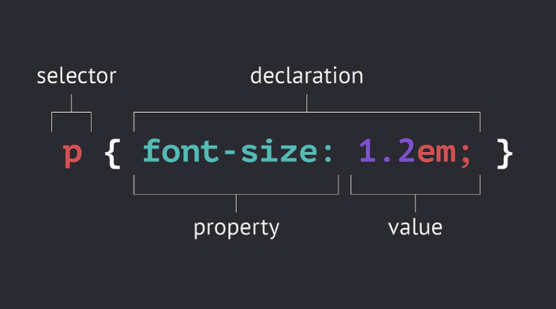

## 선택자와 선언

선택자는 스타일을 지정할 웹페이지 HTML 요소를 선택하는데 사용

- selector(선택자)

- declaration(선언)




## 선택자 종류

- 태그 선택자
- class 선택자 (.selector)
- ID 선택자 (#selector)


>  선택자의 우선순위 (id > class > 요소)
>
> id는 class보다 상위 선택자이며 동일요소에 대한 스타일이 중복 정의된 경우 id 스타일이 우선 적용됨

```html
<!DOCTYPE html>
<html>
  <head>
    <style>
      li{
        color:red;
        text-decoration:underline;
      }
      #select{
        color:blue;
      }
      .select {
        color:green;        
      }
    </style>
  </head>
  <body>
    <ul>
      <li>HTML</li>
      <li id="select" class="select">CSS</li>
      <li class="select">JavaScript</li>
    </ul>
  </body>
</html>
```


## 부모 자식 선택자

### 복수 선택자

```css
ul, ol {
  backgrund-color : powderblue;
}
```

### 조상 자손 선택자

```css
ul li {
  color : red;
}
```

### 부모 자식 선택자

`#lecture` 바로 밑에 있는 `li` 태그만을 선택

```css
#lecture > li {
  border : 1px solid red;
}
```


##  가상 클래스 선택자

가상(pseudo) 클래스 선택자는 클래스 선택자는 아니지만 엘리먼트들의 상태에 따라 마치 클래스 선택자처럼 여러 엘리먼트를 선택할 수 있다는 점에서 붙은 이름


### 링크와 관련된 가상 클래스 선택자

- `:link` 방문한적이 없는 링크
- `:visited` 방문한 적이 있는 링크
- `:hover` 마우스를 호버했을 때(blue)
- `:active` 마우스 클릭했을 때(red)
- `:focus`  포커스 되었을 때
- .. (아래서 더 많이 배울 예정)

 **위의 선택자는 순서대로 지정하는 것이 좋습니다.**


> 특히 visited의 경우는 보안상의 이유로 아래와 같은 속성만 변경이 가능합니다. 

- color
- background-color
- border-color
- outline-color
- The color parts of the fill and stroke properties

## 여러가지 선택자

http://flukeout.github.io/


- `*` You can select everything
- `A + B` Select an element that directly follows another element
- `:first-child` Select a first child element inside of another element
- `:only-child` Select an element that are the only element inside of another one
- `:last-child` Select the last element inside of another element
- `:nth-child(A)`  Select an element by its order in another element
- `:nth-last-child(A)` Select an element by its order in another element, counting from the back
- `:first-of-type` Select the first element of a specific type
- `:nth-of-type(A)` Selects a specific element based on its type and order in another element - or even or odd instances of that element.
- `:nth-of-type(An+B)` The nth-of-type formula selects every nth element, starting the count at a specific instance of that element.
- `:only-of-type` Select elements that are the only ones of their type within of their parent element

- `:last-of-type` Select the last element of a specific type
- `:empty` Select elements that don't have children
- `:not(X)` Select all elements that don't match the negation selector
- `[attribute]`  Select all elements that have a specific attribute
- `A[attribute]` Select all elements that have a specific attribute

- `[attribute="value"]`  Select all elements that have a specific attribute value
- `[attribute^="value"]` Select all elements with an attribute value that starts with specific characters
- `[attribute*="value"]` Select all elements with an attribute value that contains specific characters anywhere


> `:xxx-child`, `:xxx-of-type` 차이
>
> -child는 태그의 종류와 상관없이 1개만 있는 것을 의미
>
> -of-type는 같은 태그 타입중에서 1개만 있는 것을 의미