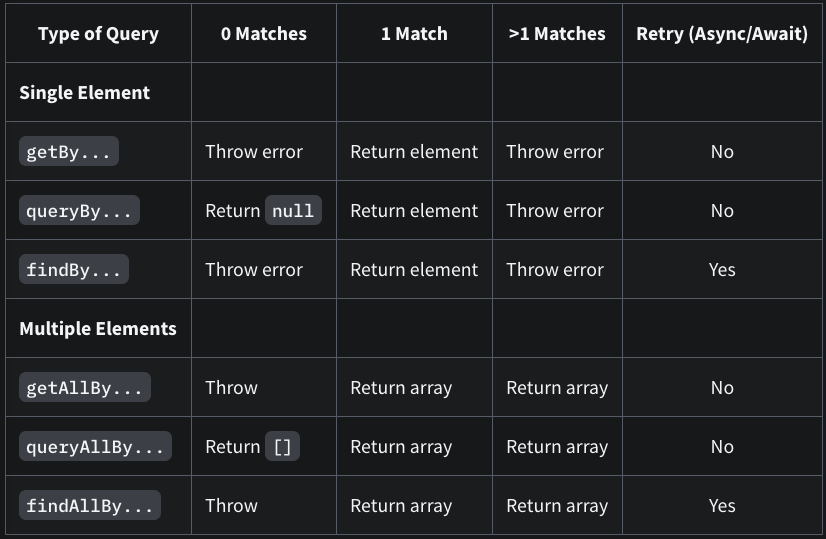

- `Query` 는 페이지에서 요소를 찾기 위해 제공하는 방법입니다. (get, find, query)

## Query




### get...

- `getBy...`
  - 쿼리에 일치하는 노드를 반환
  - 일치하는 요소가 없거나 둘 이상이 일치하면 오류

- `getAllBy...`
  - 쿼리에 대해 일치하는 모든 노드의 배열을 반환
  - 일치하는 요소가 없으면 오류


### query...

- `queryBy...`
  - 쿼리와 일치하는 첫 번째 노드를 반환
  - 일치하는 요소가 없다면 null 반환하고 (노드가 존재하지 않음을 테스트할 때 사용) 일치하는 요소가 둘 이상이면 오류

- `queryAllBy...`
  - 쿼리에 대해 일치하는 모든 노드의 배열을 반환
  - 일치하는 요소가 없으면 빈 배열 ([])을 반환


### find...

- `findBy...`
  - 주어진 쿼리와 일치하는 요소가 발견되면 Promise를 반환
  - Promise는 요소가 없거나 둘 이상의 요소가 발견되면 혹은 1000ms의 기본 제한 시간이 지나면 Reject
- `findAllBy...`
  - 주어진 쿼리와 일치하는 요소가 발견되면 요소 배열로 Promise 반환
  - Promise는 요소가 없거나 1000ms의 기본 제한 시간이 지나면 Reject


### Query 사용

쿼리를 사용하려면 `container`를 첫 번째 인수로 전달해야합니다.

`document.body`를 사용하는 경우  대신 `screen` 를 사용하는 것을 권장합니다.


쿼리에 대한 기본 인수는 `string, regular expression, function`일 수 있습니다.

텍스트 구문을 parsing하는 `TextMatch` 옵션도 있습니다.


```html
<body>
  <div id="app">
    <label for="username-input">Username</label>
    <input id="username-input" />
  </div>
</body>
```


```react
import { screen, getByLabelText } from '@testing-library/dom'

// With screen:
const inputNode1 = screen.getByLabelText('Username')

// Without screen, you need to provide a container:
const container = document.querySelector('#app')
const inputNode2 = getByLabelText(container, 'Username')
```


### Manual Query

일반 `querySelector DOM API`를 사용하여 요소를 쿼리 할 수 있습니다.

```react
// @testing-library/react
const { container } = render(<MyComponent />)
const foo = container.querySelector('[data-foo="bar"]')
```

