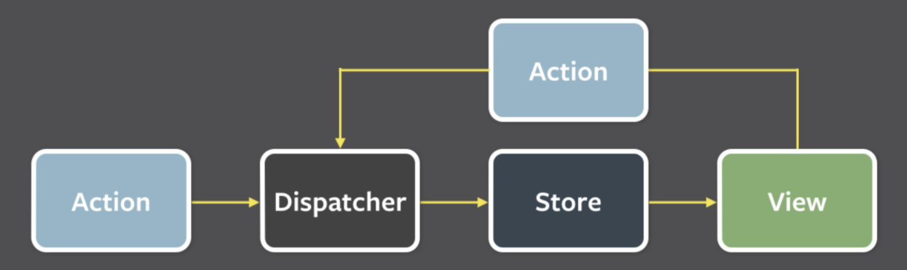

Redux를 개념적으로 이해해보자

- https://ko.redux.js.org/

## Redux

### Store

앱의 전체 상태를 가지고 있는 저장소

### Action

Store에 정보를 전달하기 위한 데이터 묶음 (Store안의 상태를 바꾸는 유일한 방법)

### Reducer

상태변화를 Store에 전달 (전달받은 Action을 어떻게 Store에 업데이트할지)

## Store

- getState()
- dispatch(action)
- subscribe(listener)
- replaceReducer(nextReducer)

## Middleware

스토어의 dispatch 메서드를 감싸 임의의 기능을 넣어 확장하는 방법이다.  여러 미들웨어를 조합할 수 있다는 특징이 있다.

개인적으로 이해하는데 어려움이 있던 부분으로 Redux내 미들웨어를 활용하여 어떻게 비동기처리를 하는지 redux-thunk, redux-promise를 통해 살펴보자.

<u>액션생성자는 dispatch를 인수로 받아 비동기적으로 호출할 수 있으며</u>, 이런 함수를 thunk라 부른다. <u>promise의 비동기 액션의 보내고 이 promise가 결정되었을 때 실제 액션을 보내는 방식</u>으로 처리도 가능하다.

## Connect

Redux는 상태관리방법으로 컴포넌트에서 Redux의 상태에 어떻게 접근할지는 다른 차원의 문제이다. connect() 함수는 (Provider 하위) 컴포넌트가 Store에 접근하도록 설정하는 함수이다. 

### mapStateToProps

컴포넌트가 Store의 상태를 props로 접근할 수 있도록 만든다.

### mapDispatchToProps

컴포넌트가 Store의 상태를 바꾸기위해 dispatch를 사용할 수 있게 만든다. 

> 위에 두 함수가 없을 때 컴포넌트내에서 Redux의 상태에 어떻게 접근할지 상상해보라. Connect의 개념이 왜 필요한지 알 수 있을 것이다.

## optimization

### shallowEqual

**react-redux** 기능입니다. shallowEqual은 얕은 비교를 하여 값이 변경되었을 때만 state값을 갱신합니다.

### selector