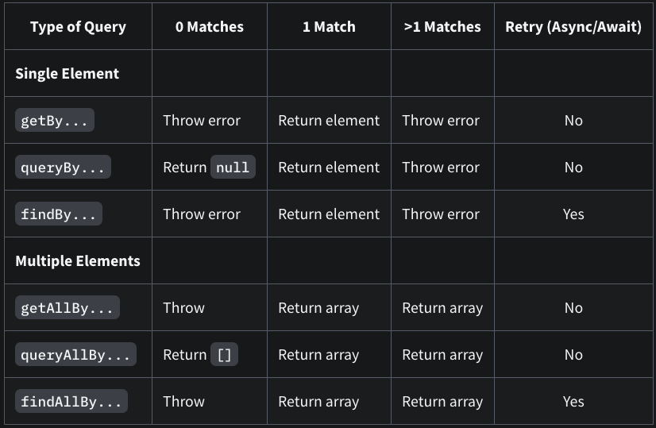

## Queries

```react
import { render, screen } from '@testing-library/react' // (or /dom, /vue, ...)

test('should show login form', () => {
  render(<Login />)
  const input = screen.getByLabelText('Username')
  // Events and assertions...
})
```

### getBy..., getAllBy...

`getBy...`

쿼리에 일치하는 노드를 반환

일치하는 요소가 없거나 둘 이상이 일치하면 오류

`getAllBy...`

쿼리에 대해 일치하는 모든 노드의 배열을 반환

일치하는 요소가 없으면 오류

### queryBy..., queryAllBy...

`queryBy...`

쿼리와 일치하는 첫 번째 노드를 반환

일치하는 요소가 없다면 null 반환하고 (노드가 존재하지 않음을 테스트할 때 사용) 일치하는 요소가 둘 이상이면 오류

`queryAllBy...`

쿼리에 대해 일치하는 모든 노드의 배열을 반환

일치하는 요소가 없으면 빈 배열 ([])을 반환

### findBy..., findAllBy...

`findBy...`

주어진 쿼리와 일치하는 요소가 발견되면 Promise를 반환

Promise는 요소가 없거나 둘 이상의 요소가 발견되면 혹은 1000ms의 기본 제한 시간이 지나면 Reject

`findAllBy...`

주어진 쿼리와 일치하는 요소가 발견되면 요소 배열로 Promise 반환

Promise는 요소가 없거나 1000ms의 기본 제한 시간이 지나면 Reject


